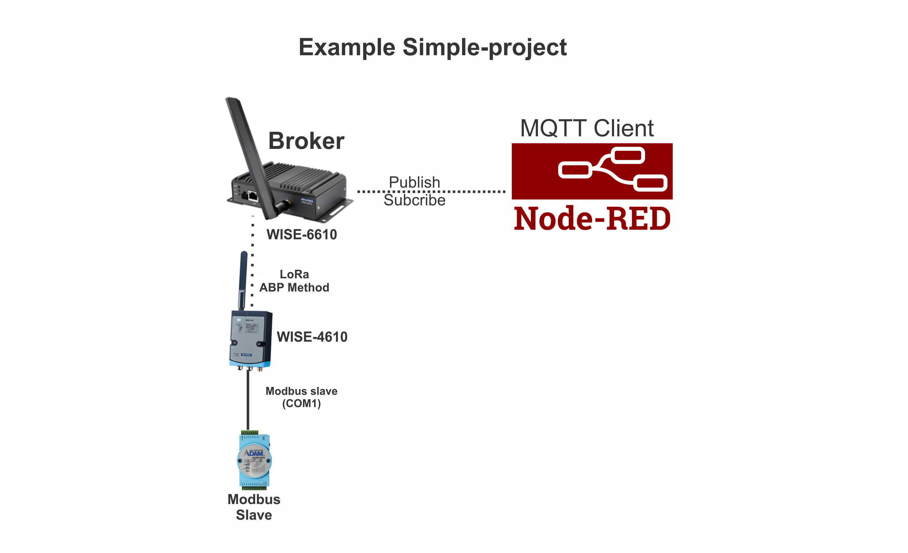

Pada percobaa satu ini, saya akan membuat project sederhana bagaimana menggunakan protocol MQTT di WISE-4610 dan WISE-6610. Untuk gambar topology systemnya seperti pada gambar berikut:
- Contoh project Sederhana LoRa-Wan dengan protocol MQTT

Dari gambar diatas, WISE-4610 menjadi master modbus dari Slave modbus. Kemudian data dari WISE-4610 akan dipublish ke WISE-6610 yang digunakan sebagai broker. Node-red akan digunakan sebagai MQTT client dimana dari dari WISE-4610 akan ditampilkan di dashboard sederhana. Untuk langkah-langkahnya sebagai berikut:
- Aktifkan MQTT broker di WISE-6610

- Pastikan, data dari WISE-4610 sudah terpublish. Berikut merupakan status DI dan COM1 pada WISE-4610 yang akan dipublish pada MQTT broker.

Data yang sudah dipublish akan di subcribe oleh MQTT client. Pada contoh ini saya menggunakan MQTTbox sebagai MQTT client yang akan men-subcribe data publish dari WISE-4610. Topic yang digunakan seperti pada gambar berikut. Sebelumnya MQTTbox sudah terkoneksi dengan Broker (WISE-6610)

Jika terdapat data berupa json yang di subcribe seperti gambar diatas, maka data siap diolah dan ditampilkan di Node-red dashboard.