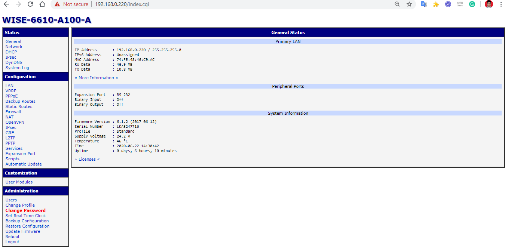
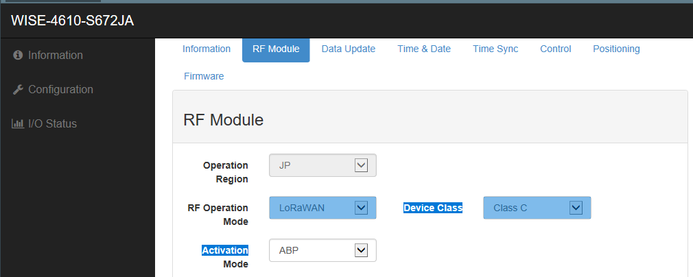
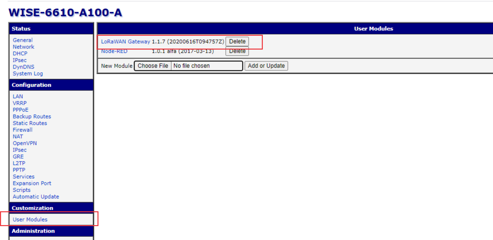
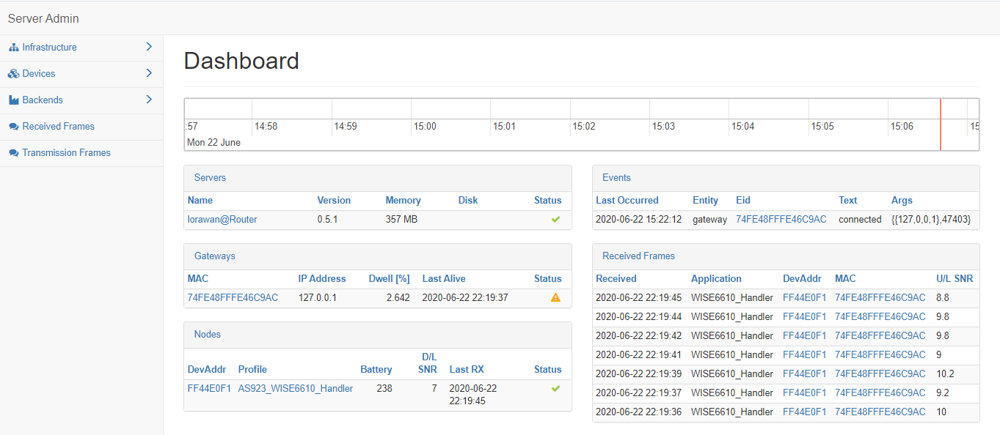
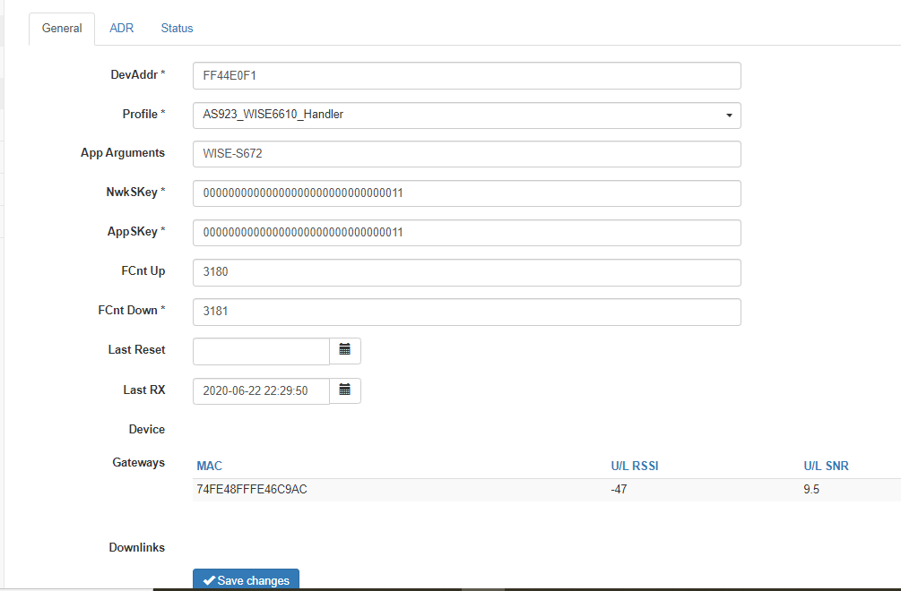
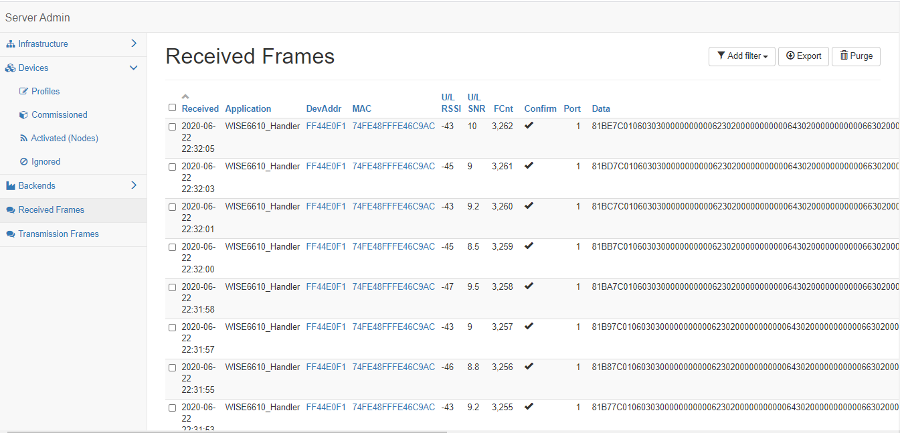

Kesempatan kedua ini saya akan menjelaskan bagaimana menggunakan LoRa gateway WISE-6610 dan bagaimana caranya agar terkoneksi dengan WISE-4610. 

1. Web base WISE-6610

Pertama koneksikan WISE-6610 dengan kabel UTP ke laptop/PC. Kemudian buka web Browser dan masukkan IP WISE-6610(Default IP 192.168.1.1) kemudian nanti akan tampil dashboard Login. Login dengan user "root" dan password "root". Untuk tampilanya seperti berikut:

- Dashboard Login WISE-6610

Jika berhasil login, maka akan tampil didashbaord beberapa menu seperti berikut:
- Dashboard WISE-6610

2. Cara menghubungkan WISE-4610 ke WISE-6610
Ada dua methode untuk mengkoneksikan WISE-4610 ke WISE-6610 yaitu ABP dan OTA. Namun, disempatan saat ini yang saya gunakan adalah ABP method. Pertama config WISE-4610 seperti pada langkah-langkap berikut:
- Pertama, config RF Module WISE-4610 dengan RF operation mode LoRaWan dan Activation Mode ABP.

- Kedua, buka web base WISE-6610 kemudian pilih user modules dan klik LoRaWan Gateway. Sebelumnya, update terlebih dulu firmware LoRawan Gateway. Untuk link download firmware [disini](https://drive.google.com/file/d/1Fh0pt9XMcwbPPYURq_KFbsF7VDgYPbyI/view)

Setelah LoRaWan Gateway di-klik maka tampilan dashboard seperti berikut.

- Ketiga, klik Network server maka akan tampil dashboard seperti berikut

- Selanjutnya, pilih Devices untuk mendaftarkan WISE-4610 node di LoRaGateway WISE-6610. Pada Device terdapat beberapa pilihan yaitu commusioned jika ingin menggunakan OTAA method sedangkan Activated jika ingin menggunakan ABP. Karena Lora node sudah dimode dengan ABP, jadi daftarkan devAddr, NwkSkey, AppSKey yang ada di WISE-4610 di Activated node seperti pada gambar berikut :

Jika berhasil maka, log data yang dikirim dari WISE-4610 ada di Received frames pada Dashboard WISE-6610.
