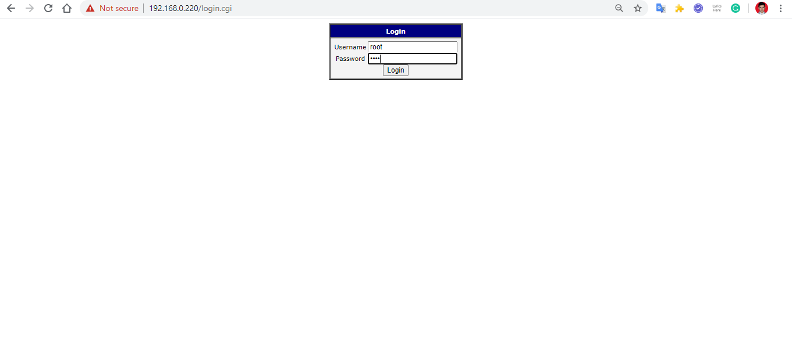

Kesempatan kedua ini saya akan menjelaskan bagaimana menggunakan LoRa gateway WISE-6610 yang merupakan product dari Advantech. 
1. Web base WISE-6610

Pertama koneksikan WISE-6610 dengan kabel UTP ke laptop/PC. Kemudian buka web Browser dan masukkan IP WISE-6610(Default IP 192.168.1.1) kemudian nanti akan tampil dashboard Login. Login dengan user "root" dan password "root". Untuk tampilanya seperti berikut:
- Dashboard Login WISE-6610

Jika berhasil login, maka akan tampil didashbaord beberapa menu seperti berikut:
- Dashboard WISE-6610
