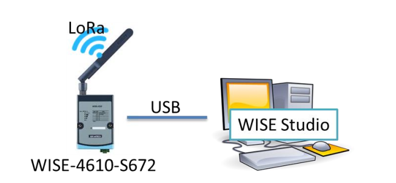
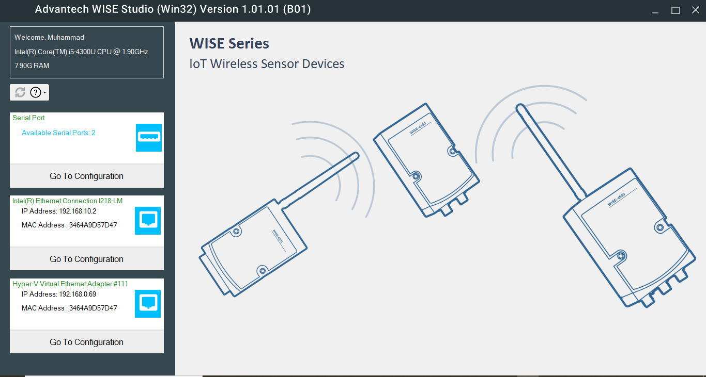
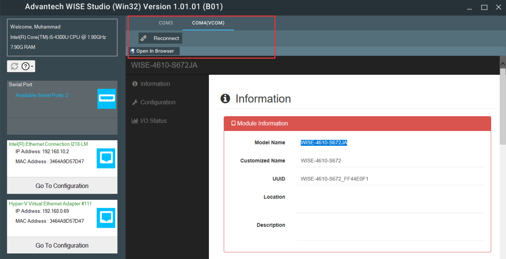

Pada kesempatan ini saya akan berbagi tentang bagaimana cara menggunakan dan configurasi salah satu product dari advantech yang sudah menggunakan teknologi LoRa (Longe Range) yaitu Wise-4610:

1. Koneksi WISE-4610 ke WISE Studio
Pertama install terlebih dulu [Wise studio](https://support.advantech.com/support/DownloadSRDetail_New.aspx?SR_ID=1-1MJSJKX&Doc_Source=Download). Install aplikasi tersebut kemudian hubungkan WISE-4610 melalui Port USB seperti gambar berikut :
- Connect WISE-4610 to Laptop/PC use port USB

Buka aplikasi WISE Studio untuk tampilkannya seperti berikut :
- WISE Studio

Untuk remote WISE-4610, buka Goto Configuration pada WISE Studio. Pastikan sebelumnya driver WISE-4610 sudah terinstall. Untuk link download driver [di sini](https://support.advantech.com/support/SearchResult.aspx?keyword=WISE-4610&searchtabs=BIOS,Certificate,Datasheet,Documentation,Driver,Firmware,Manual,Online%20Training,Software%20Utility,Utility,FAQ,Installation,Software%20API,Software%20API%20Manual,3D%20Model,Quick%20Start%20Guide,Reference,eCatalog,Video,Webcast,Whitepaper,SDK,OS&select_tab=Driver). Setelah itu koneksikan WISE studio dengan WISE-4610 berdasarkan driver yang sudah berhasil terinstall tadi. Pada contoh ini, driver berhasil terinstall di COM4. Untuk gambar setelah berhasil ter koneksi seperti berikut:
- WISE-4610-S672JA Config

Jika sudah berhasil, pada menu konfigurasi tersebut terdapat beberapa menu seperti Information, Configuration dan I/O Status.
3. Update Firmware
Pertama, download terlebih dulu firmware WISE-4610 pada [link ini](Firmware/WISE-4610_vA113B00_JA_UT.bin). Kemudian buka menu Configuration pada WISE Studio Lalu pilih Firware. Pada configurasi tersebut tersedia tempat untuk memilih file dan upload file. Maka pilih file firmware yang sudah tadi di Download kemudian upload ke WISE-4610. Untuk gambarnya seperti berikut :
- Update Firmware WISE-4610

Tunggu proses uploading hingga 100 %. Jika sudah maka firmware pada WISE-4610 sudah berhasil ter-update.

